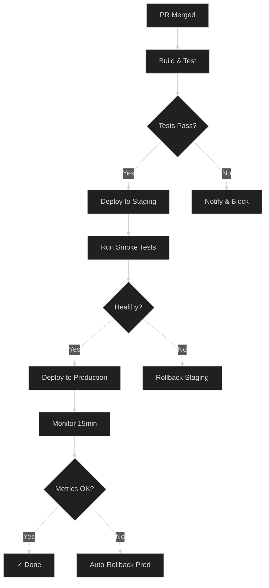

<!-- generated below — do not edit, use trail commands -->

## goal

Build a CI/CD pipeline that takes code from PR merge through staging validation to production deployment with automated rollback

## diagram

## constraints

- Zero-downtime deployments only
- All environments must use the same Docker image
- Rollback must complete within 60 seconds

## files

| path | role |
|---|---|
| .github/workflows/deploy.yml | main pipeline definition |
| scripts/rollback.sh | rollback automation |
| k8s/staging/deployment.yaml | staging k8s config |
| k8s/prod/deployment.yaml | production k8s config |

## tasks

- [x] 00 · Set up Docker multi-stage build
- [x] 01 · Configure GitHub Actions workflow
- [▶] 02 · Add staging deployment with smoke tests

  **spec:** Deploy to staging namespace, run health checks and smoke test suite

  **verify:**
  - [ ] k8s deployment rolls out
  - [ ] smoke tests pass against staging URL
  - [ ] metrics dashboard shows healthy

  **files:** k8s/staging/deployment.yaml, scripts/smoke-test.sh

- [ ] 03 · Implement production deployment with canary
- [ ] 04 · Build automated rollback system

## context

| field | value |
|---|---|
| current_file | k8s/staging/deployment.yaml |
| last_error | ~ |
| test_state | 12 passing |
| open_questions | Should we use Argo Rollouts or custom canary logic? |
| pending_refactor | ~ |

## decisions

- 2026-03-15 · Use GitHub Actions over Jenkins — simpler, already integrated
- 2026-03-15 · Docker multi-stage build to keep image small
- 2026-03-16 · Staging smoke tests before any prod deployment

## notes
